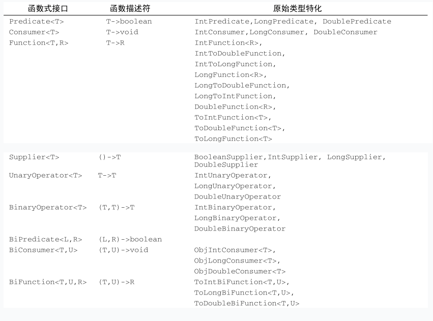

## Functional Interface
see:  
- https://www.cnblogs.com/invoker-/p/7709052.html
- http://www.runoob.com/java/java8-functional-interfaces.html

> 定义：
> 1. 是接口，有且仅有一个抽象方法。
> 2. 可以有多个default-method，或者继承自`Object.class`的抽象方法。
> 3. 可以被隐式转换成lambda表达式。
> 4. `@FunctionalInterface`只是用于编译期检测是否符合functional-interface规范。

JDK 1.8之前已有的函数式接口:
- java.lang.Runnable
- java.util.concurrent.Callable
- java.security.PrivilegedAction
- java.util.Comparator
- java.io.FileFilter
- java.nio.file.PathMatcher
- java.lang.reflect.InvocationHandler
- java.beans.PropertyChangeListener
- java.awt.event.ActionListener
- javax.swing.event.ChangeListener
JDK 1.8 新增加的函数接口：
- package java.util.function

### java.util.function 命名规范
摘自：https://www.cnblogs.com/invoker-/p/7709052.html  

1. 类型限制接口
- 参数类型,例如`IntPredicate, LongPredicate, DoublePredicate`，这几个接口，都是在基于`Predicate`接口的。
不同的就是他们的类型分别变成了基础类型`int, long, double`。
比如`IntConsumer`可以对应`Consumer<Integer>`，但因为泛型不支持基础类型，所以只能是`Integer`。

- 返回值类型，和上面类似，只是命名的规则上多了一个To，例如`IntToDoubleFunction, IntToLongFunction`。
很明显就是对应的`Function<Integer, Double>, Fcuntion<Integer, Long>`，其余同理。
另外需要注意的是，参数限制与返回值限制的命名唯一不同就是`To`，简单来说，前面不带`To`的都是参数类型限制，带`To`的是返回值类型限制。
对于没有参数的函数接口，那显而易见只可能是对返回值作限制。
例如`LongFunction<R>`就相当于`Function<Long, R>`，而多了一个To的`ToLongFunction<T>`就相当于`Function<T, Long>`，也就是对返回值类型作了限制。

2. 数量限制接口
- 有些接口需要接受两名参数，此类接口的所有名字前面都是附加上`Bi, Binary`，是二元的意思，例如`BiPredicate, BiFunction`等。
而由于java没有多返回值的设定，所以`Bi`指的都是参数为两个`Operator接口`。

3. Operator接口
- 此类接口只有2个：`UnaryOperator<T> extends Function<T, T>`，`BinaryOperator<T> extends BiFunction<T,T,T>`。
这类接口属于`Function`的扩展（简化），它们只有一个泛型参数，意思是`Function`的参数与返回值类型相同。
一般多用于操作计算，计算`a + b`的`BiFunction`如果限制条件为`Integer`的话，往往要这么写`BiFunction<Integer,Integer,Integer>`前2个泛型代表参数，最后一个代表返回值。
看起来似乎是有点繁重了，这个时候就可以用`BinaryOperator<Integer>`来代替了。

