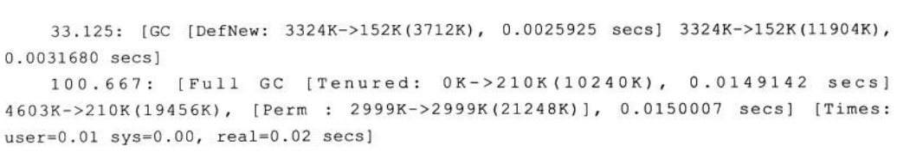

# GC、JVM相关

## 只需要记住就行
1. 尽可能地避免对象过早地进入老年代，尽可能晚地触发 Full GC。
2. Stop The World，即在 GC（minor GC 或 Full GC）期间，只有垃圾回收器线程在工作，其他工作线程则被挂起。
3. minor GC采用`复制算法`，full gc采用`标记整理算法`。

## 概括

1. 垃圾回收主要算法（各有优劣）
1.1) 标记清除
缺点，会产生内存碎片。

1.2) 复制算法
解决`标记清除`产生的内存碎片。但随之带来的缺点：  
  i) 内存使用率低，比如分配500mb，实际只有250mb可用；  
  ii) 移动带来性能降低

1.3) 标记整理
缺点，每进一次垃圾清除都要频繁地移动存活的对象，效率十分低下。

1.4) 分代收集算法（首选策略）
分代收集算法整合了以上算法，综合了这些算法的优点，最大程度避免了它们的缺点，所以是现代虚拟机采用的首选算法。  
与其说它是算法，倒不是说它是一种策略，因为它是把上述几种算法整合在了一起。

2. 如何识别垃圾
- 引用计数法：<font color="red">已废弃<font>，因为无法解决循环引用。
- 可达性算法：基本都采用此种算法

## 术语

1. Stop The World
> 如果**老年代**满了，会触发 Full GC, **Full GC 会同时回收新生代和老年代（即对整个堆进行GC）**，
> 它会导致 Stop The World（简称 STW）,造成挺大的性能开销。
>
> 什么是 STW ？  
> 所谓的 STW, 即在 GC（minor GC 或 Full GC）期间，<font color="red">只有垃圾回收器线程在工作，其他工作线程则被挂起。</font>
>
> Minor GC 也会造成 STW,但只会触发轻微的 STW,因为 Eden 区的对象大部分都被回收了，只有极少数存活对象会通过复制算法转移到 S0 或 S1 区，所以相对还好

2. Safe Point
> 由于 Full GC（或Minor GC） 会影响性能，所以我们要在一个合适的时间点发起 GC，这个时间点被称为 Safe Point，
> 这个时间点的选定既不能太少以让 GC 时间太长导致程序过长时间卡顿，也不能过于频繁以至于过分增大运行时的负荷。
> 一般当线程在这个时间点上状态是可以确定的，如确定 GC Root 的信息等，可以使 JVM 开始安全地 GC。Safe Point 主要指的是以下特定位置：
>  - 循环的末尾
>  - 方法返回前
>  - 调用方法的 call 之后
>  - 抛出异常的位置
>
> 另外需要注意的是由于新生代的特点（大部分对象经过 Minor GC后会消亡）， Minor GC 用的是复制算法，
> 而在老生代由于对象比较多，占用的空间较大，使用复制算法会有较大开销（复制算法在对象存活率较高时要进行多次复制操作，同时浪费一半空间）
> 所以根据老生代特点，在老年代进行的 GC 一般采用的是标记整理法来进行回收。

## 监控工具
0. jvm 自带打印GC信息
```
-XX:+PrintGCDetails  打印GC信息
-XX:+PrintGCDateStamps 打印GC时间
```

```JAVA
public class LocalVariableBugMainTest {

    public static void main(String[] args) {
        if (true) {
            byte[] placeHolder = new byte[64 * 1024 * 1024];
            System.out.println(placeHolder.length / 1024);
            // placeHolder = null;
        }
        System.gc();
    }
}
```

```text
65536
2020-01-29T16:00:40.623+0800: [GC (System.gc()) [PSYoungGen: 3331K->1101K(38400K)] 68867K->66645K(125952K), 0.0025174 secs] [Times: user=0.00 sys=0.00, real=0.00 secs] 
2020-01-29T16:00:40.623+0800: [Full GC (System.gc()) [PSYoungGen: 1101K->0K(38400K)] [ParOldGen: 65544K->66507K(87552K)] 66645K->66507K(125952K), [Metaspace: 3273K->3273K(1056768K)], 0.0105438 secs] [Times: user=0.00 sys=0.00, real=0.00 secs] 
Heap
 PSYoungGen      total 38400K, used 333K [0x00000000d5b80000, 0x00000000d8600000, 0x0000000100000000)
  eden space 33280K, 1% used [0x00000000d5b80000,0x00000000d5bd34a8,0x00000000d7c00000)
  from space 5120K, 0% used [0x00000000d7c00000,0x00000000d7c00000,0x00000000d8100000)
  to   space 5120K, 0% used [0x00000000d8100000,0x00000000d8100000,0x00000000d8600000)
 ParOldGen       total 87552K, used 66507K [0x0000000081200000, 0x0000000086780000, 0x00000000d5b80000)
  object space 87552K, 75% used [0x0000000081200000,0x00000000852f2f60,0x0000000086780000)
 Metaspace       used 3280K, capacity 4496K, committed 4864K, reserved 1056768K
  class space    used 356K, capacity 388K, committed 512K, reserved 1048576K
```

`GC`: 表示Young-GC。GC日志含义：[理解GC日志](https://www.cnblogs.com/lmy-foolishbird/p/5259588.html)  
  
  1) 最前面的数字“33.125”和“100.667”代表了GC发生的时间，这个数字的含义是从Java虚拟机启动以来经过的秒数；
  2) GC日志开头的[GC 和[Full GC 说明了这次垃圾收集的停顿类型；如果有full说明这次GC是发生了Stop-The-World的；
  3) [DefNew、[Tenured、[Perm表示GC发生的区域，这里显示的区域名称和使用的GC收集器是密切相关的，表示用了什么收集器；DefNew表示Default New Generation默认的收集器一般是Serial收集器。
  4) 3324K->152K(3712K)：含义是“GC前该内存区域已使用容量->GC后该内存区域已使用容量(该内存区域总容量)”
  5) 3324K->152K(11904K)：含义是“GC前Java堆已经使用容量->GC后java堆已经使用的容量（Java堆的总容量）”
  6) [Times：user=0.01 sys=0.00，real=0.02 secs]：分别代表用户态小号的CPU时间、内核消耗的CPU时间和操作从开始到结束所经过的墙钟时间。


1. [Visual VM](https://visualvm.github.io/)
  - [visualVM 插件 visual gc 使用介绍](https://www.cnblogs.com/reycg-blog/p/7805075.html)
  - [Visual GC 插件使用](https://www.jianshu.com/p/9e4ccd705709)
  - [visualgc - Visual Garbage Collection Monitoring Tool](https://www.oracle.com/technetwork/java/visualgc-136680.html)


2. [JProfiler](https://www.ej-technologies.com/products/jprofiler/overview.html)
  - [Java性能分析神器-JProfiler详解（转）](https://www.cnblogs.com/jpfss/p/8488111.html)
  - [JProfiler性能分析工具详解](https://www.codercto.com/a/25685.html)


## 文章参考
1. [Java : 对象不再使用时，为什么要赋值为 null ？](https://mp.weixin.qq.com/s/bIk15c23PDUjMmpZ0njgKQ)
（内容不多，建议仔细看完，特别是提到的JVM BUG）

> JVM的一个“bug”：
> 代码离开变量作用域时，并不会自动切断其与堆的联系。
> 为什么这个“bug”一直存在？你不觉得出现这种情况的概率太小了么？算是一个tradeoff(取舍)了。
>
> 推断placeHolder没有被回收的原因：System.gc();触发GC时，main()方法的运行时栈中，还存在有对args和placeHolder的引用，GC判断这两个对象都是存活的，不进行回收。
> 也就是说，**代码在离开if后，虽然已经离开了placeHolder的作用域，但在此之后，没有任何对运行时栈的读写，placeHolder所在的索引还没有被其他变量重用，所以GC判断其为存活。**

个人测试代码`LocalVariableBugMainTest.java`：
  1) 如果把测试代码提升成独立的方法，也不会回收`placeHolder`。
  2) 如果在**方法结束后执行GC**，可以回收之前不可回收的`placeHolder`。


2. [看完这篇垃圾回收，和面试官扯皮没问题了](https://mp.weixin.qq.com/s/8vXENzg580R7F2iNjSdHFw)
**一定要看，写的很好的文章**