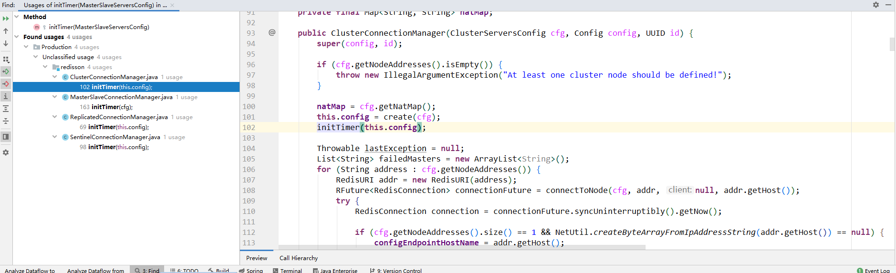

# Timer & TimerTask

已知的2个`Timer`：
- `java.util.Timer`: jdk
- `io.netty.util.Timer`: netty

## netty 

### io.netty.util.HashedWheelTimer
```
io.netty.util.Timer timer = new HashedWheelTimer();

io.netty.util.TimerTask timerTask = new TimerTask() {
    @Override
    public void run(Timeout timeout) throws Exception {
        log.info("...run...");

        timer.newTimeout(this, 0, TimeUnit.MILLISECONDS);
    }
};

// 第一次执行（只执行一次）
timer.newTimeout(timerTask, 0, TimeUnit.MILLISECONDS);

```

```
输出结果：
14:33:20.728 [pool-1-thread-1] INFO com.vergilyn.examples.netty.TimerTaskTest - ...run...
14:33:20.841 [pool-1-thread-1] INFO com.vergilyn.examples.netty.TimerTaskTest - ...run...
14:33:20.928 [pool-1-thread-1] INFO com.vergilyn.examples.netty.TimerTaskTest - ...run...
14:33:21.029 [pool-1-thread-1] INFO com.vergilyn.examples.netty.TimerTaskTest - ...run...
14:33:21.129 [pool-1-thread-1] INFO com.vergilyn.examples.netty.TimerTaskTest - ...run...
14:33:21.227 [pool-1-thread-1] INFO com.vergilyn.examples.netty.TimerTaskTest - ...run...
14:33:21.328 [pool-1-thread-1] INFO com.vergilyn.examples.netty.TimerTaskTest - ...run...
14:33:21.429 [pool-1-thread-1] INFO com.vergilyn.examples.netty.TimerTaskTest - ...run...
14:33:21.529 [pool-1-thread-1] INFO com.vergilyn.examples.netty.TimerTaskTest - ...run...
14:33:21.627 [pool-1-thread-1] INFO com.vergilyn.examples.netty.TimerTaskTest - ...run...
14:33:21.729 [pool-1-thread-1] INFO com.vergilyn.examples.netty.TimerTaskTest - ...run...
14:33:21.828 [pool-1-thread-1] INFO com.vergilyn.examples.netty.TimerTaskTest - ...run...
14:33:21.929 [pool-1-thread-1] INFO com.vergilyn.examples.netty.TimerTaskTest - ...run...
```

通过输出结果可以看出，其类似间隔`100ms`执行一次，但代码中明明指定的是`delay = 0ms`，难道`newTimeout(...)`需要执行`100ms`？  

真实原因：`HashedWheelTimer`中存在`tickDuration`，通过其默认无参构造函数可知`tickDuration = 100ms`。
```
public HashedWheelTimer() {
    this(Executors.defaultThreadFactory());
}

public HashedWheelTimer(ThreadFactory threadFactory) {
    this(threadFactory, 100, TimeUnit.MILLISECONDS);
}

/**
 * Creates a new timer with the default number of ticks per wheel.
 *
 * @param threadFactory  a {@link ThreadFactory} that creates a
 *                       background {@link Thread} which is dedicated to
 *                       {@link TimerTask} execution.
 * @param tickDuration   the duration between tick
 * @param unit           the time unit of the {@code tickDuration}
 * @throws NullPointerException     if either of {@code threadFactory} and {@code unit} is {@code null}
 * @throws IllegalArgumentException if {@code tickDuration} is &lt;= 0
 */
public HashedWheelTimer(
        ThreadFactory threadFactory, long tickDuration, TimeUnit unit) {
    this(threadFactory, tickDuration, unit, 512);
}
```

> 原文链接：https://blog.csdn.net/wangyang_software/article/details/54135704<br/>
> 一个Hash Wheel Timer是一个环形结构，可以想象成时钟，分为很多格子，一个格子代表一段时间（越短Timer精度越高），<br/>
> 并用一个List保存在该格子上到期的所有任务，同时一个指针随着时间流逝一格一格转动，并执行对应List中所有到期的任务。<br/>

> HashedWheelTimer一般用来处理大量的定时任务且任务<font color="red">**对时间精度要求相对不高**</font>（比如链接超时管理等场景）。<br/>
> <font color="red">**缺点是：内存占用相对较高。**</font><br/>

> HashedWheelTimer中有两个重要的参数：<br/>
> Tick Duration：即一个格子代表的时间，默认为100ms，因为IO事件不需要那么精确；<br/>
> Ticks per Wheel (Wheel Size)：一个Wheel含有多少个格子，默认为512个，如果任务较多可以增大这个参数.<br/>

### redisson 源码中对`io.netty.util.HashedWheelTimer`的使用

```JAVA
/**
 *
 * @author Nikita Koksharov
 *
 */
public class MasterSlaveConnectionManager implements ConnectionManager {
    private HashedWheelTimer timer;
    
    protected void initTimer(MasterSlaveServersConfig config) {
        int[] timeouts = new int[]{config.getRetryInterval(), config.getTimeout()};
        Arrays.sort(timeouts);
        int minTimeout = timeouts[0];
        if (minTimeout % 100 != 0) {
            minTimeout = (minTimeout % 100) / 2;
        } else if (minTimeout == 100) {
            minTimeout = 50;
        } else {
            minTimeout = 100;
        }
        
        // redisson全局只有1个Timer实例！
        timer = new HashedWheelTimer(new DefaultThreadFactory("redisson-timer"), minTimeout, TimeUnit.MILLISECONDS, 1024, false);
        
        connectionWatcher = new IdleConnectionWatcher(this, config);
        subscribeService = new PublishSubscribeService(this, config);
    }
}
```

当redissonClient初始化时，会调用`initTimer(...)`：  



## jdk

### TimerTask 异常导致Timer中断
```
int index = 1;
Timer timer = new Timer("jdk-timer", true);
timer.schedule(new java.util.TimerTask() {
    @Override
    public void run() {
        log.info("...run...");
        index++;
        if (index == 5){
            // 如果TimerTask内部异常，会导致timer终止/中断！
            // 解决方案：try-catch内部捕获异常
            index = index / 0;
        }
    }
}, 0, 100);
```

例如以上代码，timer在执行第5次exception，会导致timer中断。  
解决方案：try-catch内部捕获异常（不能throw-exception）

## 扩展

### `schedule(...)` 与 `scheduleAtFixedRate(...)`
`scheduler(...)`: 侧重保证执行的时间间隔。  
`scheduleAtFixedRate(...)`: 侧重保证调度频率（尽快执行）。 

### 守护线程（Daemon Thread）

[守护线程(Daemon Thread)](https://www.cnblogs.com/xiarongjin/p/8310144.html):   
> 在Java中有两类线程：用户线程 (User Thread)、守护线程 (Daemon Thread)。 

> 所谓守护线程，是指在程序运行的时候在后台提供一种通用服务的线程，比如垃圾回收线程就是一个很称职的守护者，并且这种线程并不属于程序中不可或缺的部分。<br/>
> 因此，<font color="red">当所有的**非守护线程**结束时，程序也就终止了，同时会杀死进程中的所有守护线程。
> 反过来说，只要任何非守护线程还在运行，程序就不会终止。</font>

> 用户线程和守护线程两者几乎没有区别，唯一的不同之处就在于虚拟机的离开：<br/>
>   如果用户线程已经全部退出运行了，只剩下守护线程存在了，虚拟机也就退出了。
>   因为没有了被守护者，守护线程也就没有工作可做了，也就没有继续运行程序的必要了。

> 将线程转换为守护线程可以通过调用Thread对象的setDaemon(true)方法来实现。在使用守护线程时需要注意一下几点：<br/>
>   (1) thread.setDaemon(true)必须在thread.start()之前设置，否则会跑出一个IllegalThreadStateException异常。你不能把正在运行的常规线程设置为守护线程。 <br/>
>   (2) 在Daemon线程中产生的新线程也是Daemon的。<br/>
>   (3) 守护线程应该永远不去访问固有资源，如文件、数据库，因为它会在任何时候甚至在一个操作的中间发生中断。<br/>