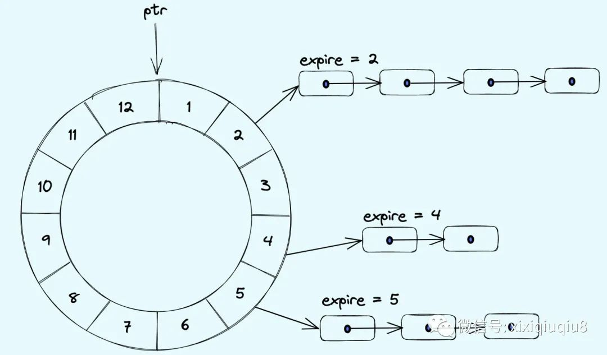
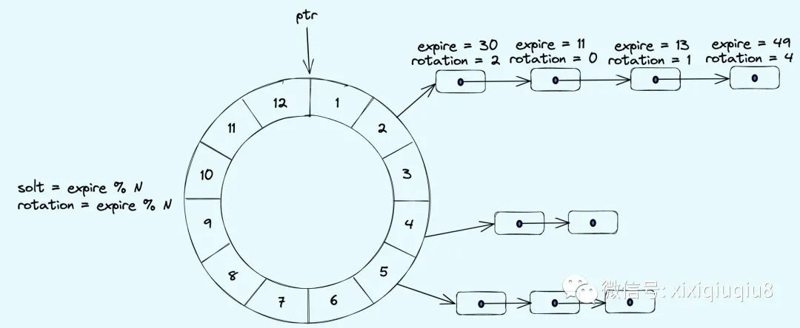
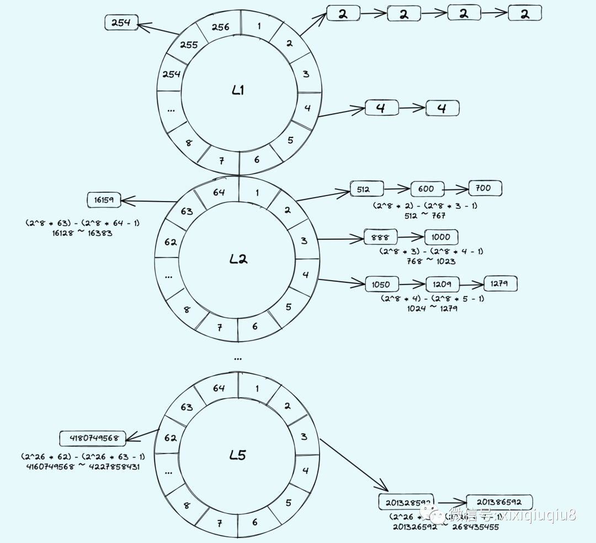

# 时间轮

+ [Hashed and Hierarchical Timing Wheels #ppt](https://www.cse.wustl.edu/~cdgill/courses/cs6874/TimingWheels.ppt): netty-common `HashedTimerWheel` javadoc中提到的。
- [时间轮（TimingWheel）算法总结](https://mp.weixin.qq.com/s/aucS9f12qsTj9YSMtVGCWA)
- [时间轮（TimingWheel）高性能定时任务原理解密](https://www.codetd.com/article/13775058)

## (基础) 单时间轮

netty 实现的 `HashedWheelTimer` 基于此实现。

## 改进版单时间轮

> 改进的单时间轮原理：  
> 每个bucket下不单单可以挂载到期时间expire=slot的定时任务，还可以挂载expire%N=slot的定时器(N为bucket个数)，如上图，  
> - expire: 代表到期时间，
> - rotation: 表示时间轮要在转动几圈之后才执行定时器，也就是说当指针转到某个bucket时，不能像简单的单时间轮那样直接执行bucket下所有的定时器。  
> 而且要去遍历该bucket下的链表，判断判断时间轮转动的次数是否等于节点中的rotation值，只有当expire和rotation都相同的情况下，才能执行定时器。

改进版单时间轮是时间和空间折中的方案，不像单时间轮那样有O(1)的时间复杂度，也不会像单时间轮那样，为了满足需求产生大量的bucket。

**缺点：** 
改进版的时间轮如果某个bucket上挂载的定时器特别多，那么需要花费大量的时间去遍历这些节点，
如果bucket下的链表每个节点的rotation都不相同，那么一次遍历下来可能只有极少数的定时器需要立刻执行的，因此很难在时间和空间上都达到理想效果。

## 多时间轮
